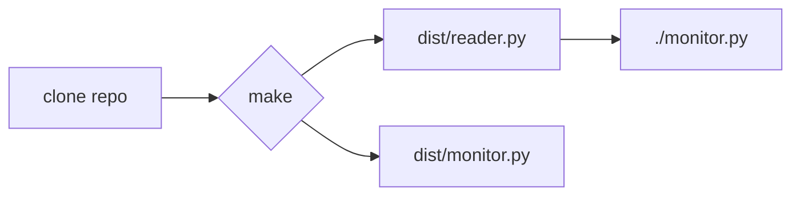
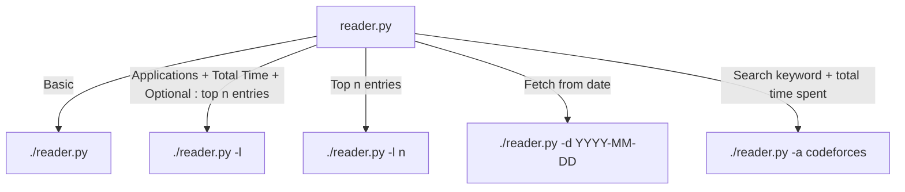

# Hyprmonitor
A simple tool to track application usage time, with visualisation support

# Description
Hyprmonitor is a python based application, currently in its CLI/TUI stage. 
Users can view their app wise usage data, tab wise usage data, and also look up the logs of a certain date for both the supported tabs
Logs are available on a per-day basis, stored as serialised dictionary objects in a logs directory

It logs the system data as a python dictionary object, the next version will be ported to a JSON logfile based system. That way, users can export the raw data and do their own personal analysis 

Future updates will include a user interface, both web-based and a standable native QT application, with graphs for visualisation, and filters for date, time, tags, and more~

It will be shipped with a systemd service, so the user can either have the monitor module in their autostart scripts, or have systemd manage the service

(yes this is a continuation of the ssm project from last summer, [ssm](https://github.com/kio42069/ssm))

# Motivation
I wanted to use a digital time tracking tool, something similar to ActivityWatch, or the one called digital wellbeing on android. The issue with AcitivityWatch was that it has absolute trash wayland compatibility, atleast after using it for a few days on Hyprland I figured so. Since its not a very hard task, I decided to start building one myself, starting with a simple cli interaction, building on to make a web based UI similar to what I observed on ActivityWatch, fixing and tweaking UI elements according to what I feel are more comfortable for the user 

# Screenshot


# Installation guide




- Clone the repository
```
git clone https://github.com/kio42069/hyprmonitor
```
- Run `make` to build the scripts and automatically store them in `/dist` folder
- The scripts will be monitor.py and reader.py 
- The `Makefile` also puts the files in your path automatically, so they will be globally accessible
- ~~Store them in any location on your path to directly call from anywhere~~
<details>
<summary>PATH guide</summary>

```
echo $path                           # to check which all directories are in your path variable
cp monitor.py /home/$USER/.local/bin # example directory
cp reader.py /usr/local/bin          # another example directory
```
</details>


# Usage
- Start by running `monitor.py` to start logging data. For now, there is no systemd service, so use tmux for launching, or enter `exec-once=monitor.py` in your hyprland.conf
- To check your statistics in a beautified way, run `reader.py`
- ### Flags
  - `reader.py -l` : to list out just aplications and their time consumed
  - `reader.py -l n` : to list out the top n entries only (n -> integer) 
  - `reader.py -d YYYY-MM-DD` : to fetch logs from a certain day
  - `reader.py -a codeforces` : a grep-ified flag, searches up just the keywords from the tabs data, and calculates the total time spent too

# Example
<details>
  <summary>reader.py</summary>
  
  ```
☁  dist [master] ⚡  reader.py                                                                    14%
[Module Reader Loaded]
--------------------------------------------------------------------------------------------------------
| Editing hyprmonitor/README.md at master · kio42069/hyprmonitor — Mozilla Firefox               0h 6m |
| surt@surt:/tmp/hyprmonitor/src                                                                 0h 3m |
| surt@surt:/tmp/hyprmonitor/dist                                                                0h 2m |
| reader.py - src - Visual Studio Code                                                           0h 2m |
| nvim README.md                                                                                 0h 1m |
| nvim reader.py                                                                                 0h 0m |
| surt@surt:/tmp/hyprmonitor                                                                     0h 0m |
| WhatsApp — Mozilla Firefox                                                                     0h 0m |
| (3) Inbox • Chats — Mozilla Firefox                                                            0h 0m |
| Touchpad Button Issue Hyprland — Mozilla Firefox                                               0h 0m |
| Welcome - src - Visual Studio Code                                                             0h 0m |
| surt@surt:~                                                                                    0h 0m |
| Inbox - surat22517@iiitd.ac.in - IIIT Delhi Mail — Mozilla Firefox                             0h 0m |
| GitHub Student Developer Pack - GitHub Education — Mozilla Firefox                             0h 0m |
| Why Use .NET — Mozilla Firefox                                                                 0h 0m |
| touchpad buttons dont work hyprland - Google Search — Mozilla Firefox                          0h 0m |
| surt@surt:/tmp                                                                                 0h 0m |
| ./monitor.py                                                                                   0h 0m |
| Creating an MVC CRUD app, part 1 | LinkedIn Learning — Mozilla Firefox                         0h 0m |
| ./reader.py -a firefox                                                                         0h 0m |
| surt@surt:/tmp/ssm                                                                             0h 0m |
| src - Visual Studio Code                                                                       0h 0m |
--------------------------------------------------------------------------------------------------------
```
</details>
<details>
  <summary>reader.py -l</summary>
  
```
☁  dist [master] ⚡  reader.py -l                                                                 14%
[Module Reader Loaded]
--------------------------------------------------------------------------------------------------------
| firefox                                                                                        0h 7m |
| Alacritty                                                                                      0h 6m |
| Code                                                                                           0h 2m |
--------------------------------------------------------------------------------------------------------
☁  dist [master] ⚡  reader.py -l 2                                                               14%
[Module Reader Loaded]
--------------------------------------------------------------------------------------------------------
| firefox                                                                                        0h 7m |
| Alacritty                                                                                      0h 6m |
--------------------------------------------------------------------------------------------------------
```
</details>

<details>
  <summary>reader.py -a firefox</summary>
  
```
☁  dist [master] ⚡  reader.py -a firefox                                                         14%
[Module Reader Loaded]
--------------------------------------------------------------------------------------------------------
| Editing hyprmonitor/README.md at master · kio42069/hyprmonitor — Mozilla Firefox               0h 6m |
| WhatsApp — Mozilla Firefox                                                                     0h 0m |
| (3) Inbox • Chats — Mozilla Firefox                                                            0h 0m |
| Touchpad Button Issue Hyprland — Mozilla Firefox                                               0h 0m |
| Inbox - surat22517@iiitd.ac.in - IIIT Delhi Mail — Mozilla Firefox                             0h 0m |
| GitHub Student Developer Pack - GitHub Education — Mozilla Firefox                             0h 0m |
| Why Use .NET — Mozilla Firefox                                                                 0h 0m |
| touchpad buttons dont work hyprland - Google Search — Mozilla Firefox                          0h 0m |
| Creating an MVC CRUD app, part 1 | LinkedIn Learning — Mozilla Firefox                         0h 0m |
| ./reader.py -a firefox                                                                         0h 0m |
--------------------------------------------------------------------------------------------------------

Total Time: 0h 6m
```
</details>
<details>
  <summary>reader.py -d 2025-05-21</summary>
  
```
☁  dist [master] ⚡  reader.py -d 2025-05-21                                                      14%
[Module Reader Loaded]
fetching records from 2025-05-21
Enter
 1. to view window stats
 2. to view all application stats: 1
ok
☁  dist [master] ⚡     
```
</details>

# Development Roadmap
- [x] Backend
- [x] TUI / CLI based user interaction
- [ ] Django based web UI 
- [ ] QT6-pyside based native desktop application
- [ ] Windows Port

# Featureset
- [x] JSON support: user can take raw collected data and use any online LLM for analysis
- [ ] Pie chart and bar graphs based visualisation
- [ ] Two tabs: 1 for application level stats, tab 2 for window level stats (more spammy == gross)
- [ ] Tags support:  sort applications by hardcoded types - productivity, gaming, development, miscellaneous 
- [ ] Browser extension: to track your browser activity as well
- [ ] Productivity mode: native to the desktop application, will use the provided notification daemon to help with productivity
- [ ] Locally hosted LLM based statistics analysis and suggestion generator

# Credits
Created by <b>kiddo42069!!</b>
